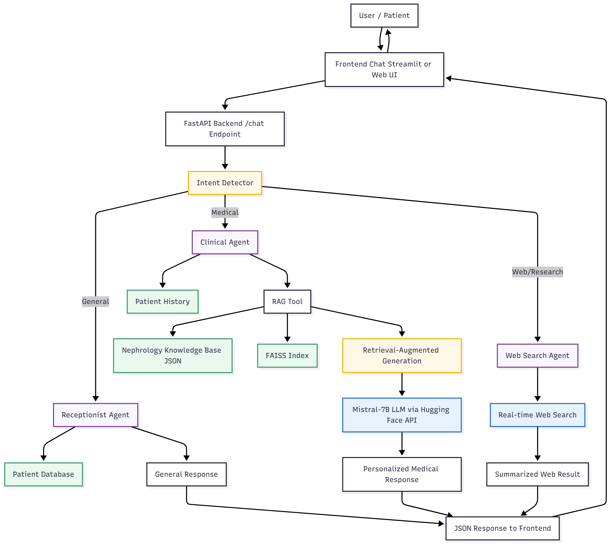

# 🏥 Post-Discharge Medical AI Assistant

A multi-agent AI system that helps patients after hospital discharge by answering queries, explaining instructions, and providing safe guidance using **LLMs**, **RAG**, and **FAISS-based retrieval**.

---

## 🧩 Problem Statement

After discharge, patients often struggle to understand their medical instructions, medications, or warning signs.  
This project aims to build an **AI assistant** that:
- Retrieves patient discharge summaries.  
- Answers medical and administrative queries safely.  
- Uses **Retrieval-Augmented Generation (RAG)** to refer to nephrology reference PDFs.  
- Fetches the **latest research** using web search integration.  

The goal is to simulate a **post-discharge support system** that reduces confusion, improves compliance, and provides context-aware help to patients.

---

## 🏗️ System Architecture

<p align="center">
  
</p>

**Workflow Overview:**
1. **Patient Query → Receptionist Agent**  
   - Identifies patient and retrieves discharge record.  
   - Routes clinical questions to the medical agent.

2. **Clinical Agent (LLM + RAG)**  
   - Uses FAISS vector search to find relevant medical chunks.  
   - Generates context-aware responses using the **Mistral-7B** model.

3. **Web Search Agent**  
   - For queries containing terms like *“latest research”* or *“new study”*.  
   - Fetches verified results via **DuckDuckGo Search (ddgs)**.

4. **Logging**  
   - Tracks agent decisions, queries, and RAG retrievals for transparency.

---

## ⚙️ How to Run

### 1. Clone the repository
```bash
git clone https://github.com/21parthh/Post-Discharge-Medical-AI-Assistant-POC-
cd Post-Discharge-Medical-AI-Assistant-POC- 
```
## Setup
```
python -m venv venv
venv\Scripts\activate  # Windows
source venv/bin/activate  # macOS/Linux
pip install -r requirements.txt
```
## Configure API Token

setx HF_TOKEN "hf_xxxxxxxxxxxxxxxxxxx"   # Windows
export HF_TOKEN="hf_xxxxxxxxxxxxxxxxxxx" # macOS/Linux

## Run Backend (FastAPI)
uvicorn backend.main:app --reload

## Run Frontend (Streamlit)
streamlit run frontend/app.py


